<h1 style="color: cornflowerblue">Rapport de l'inversion de contrôle et l'injection des dépendances</h1>
<h2 style="color: cadetblue">Introduction</h2>

IoC (Inversion of control), est un processus qui définit les dépendances d'un objet sans 
avoir à les créer. C'est lors de la création des objets, que Spring va injecter les Beans entre 
eux afin d'avoir toutes leurs dépendances.

Cela va aider le développeur la possibilité de se focaliser sur la partie Métier de l'application

Spring va s'occuper de l'injection des dépandences et toutes les fonctionnalités techniques

<h2 style="color: cadetblue">Ennoncé</h2>
<ol>
    <li>Couche DAO 
        <ul>
            <li>créer l'interface IDao</li>
            <li>créer une implémentation de l'interface IDao</li>
        </ul>
    </li>
    <li>Couche Métier
        <ul>
            <li>créer l'interface IMetier</li>
            <li>créer une implémentation de l'interface IMetier</li>
        </ul>
    </li>
    <li>Couche Présentation
        
Créer une application qui permet de faire l'injection des dépandences

        <ul>
        <li>Instantiation statique</li>
        <li>Instantiation dynamique</li>
        <li>En utilisant Spring Framework
            <ul>
                <li>version XML</li>
                <li>version Annotation</li>
            </ul>
        </li>
        </ul>
    </li>
</ol>
<h2 style="color: cadetblue">Conception</h2>
<h3>Principe du couplage faible</h3>

Pour utiliser le couplage faible, nous devons utiliser les interfaces.
Considérons une classe DaoImpl qui implémente l'interface IDao, et une classe MetierImpl qui implémente l'interface IMetier.

Si la classe MetierImpl est liée à l’interface IDao par une association, on dit que le classe MetierImpl et la classe IDaoImpl sont liées par un
couplage faible.

Cela signifie que la classe MetierImpl peut fonctionner avec n’importe quelle classe qui implémente l’interface IDao.
En effet la classe MetierImpl ne connait que l’interface IDao. De ce fait n’importe quelle classe implémentant cette
interface peut être associée à la classe MetierImpl, sans qu’il soit nécessaire de modifier quoi que se soit dans la
classe MetierImpl.

Avec le couplage faible, nous pourrons créer des applications fermées à la modification et ouvertes à
l’extension.

<h2 style="color: cadetblue">Captures d'écrans</h2>
<h3>Création de l'interface IDao</h3>
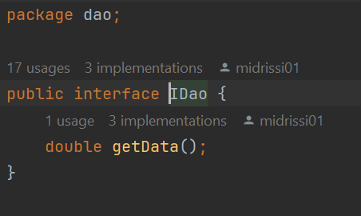
<h3>Création d'une implémentation de l'interface IDao version Base de Données</h3>
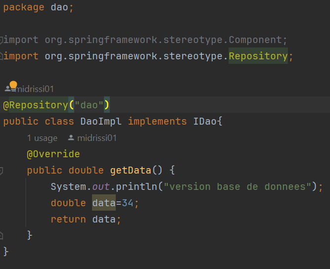
<h3>Création d'une implémentation de l'interface IDao version web services</h3>
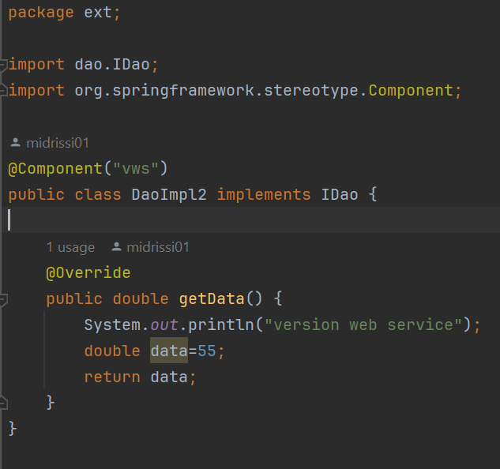
<h3>Création d'une implémentation de l'interface IDao version capteurs</h3>
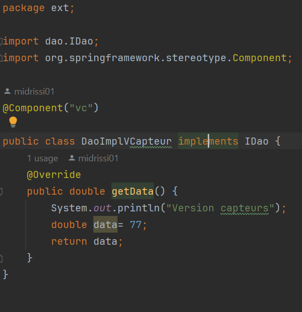

<h3>Création de l'interface IMetier</h3>
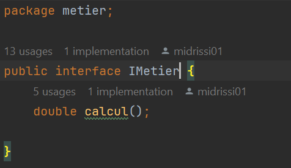
<h3>Création d'une implémentation de l'interface IMetier</h3>
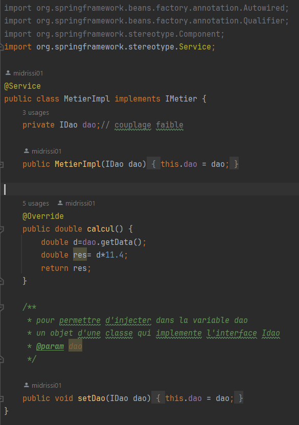

<h3>Instantiation statique</h3>
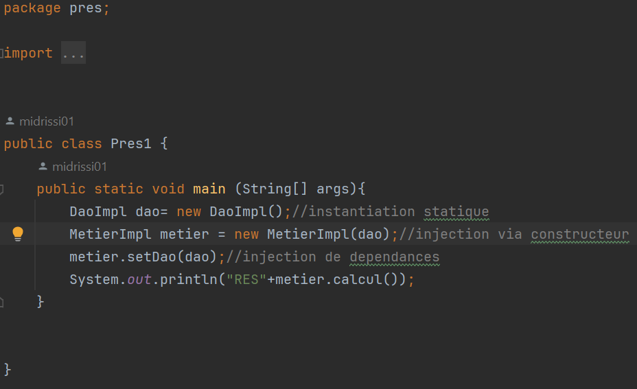

execution

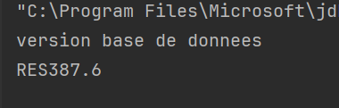
<h3>Instantiation dynamique</h3>
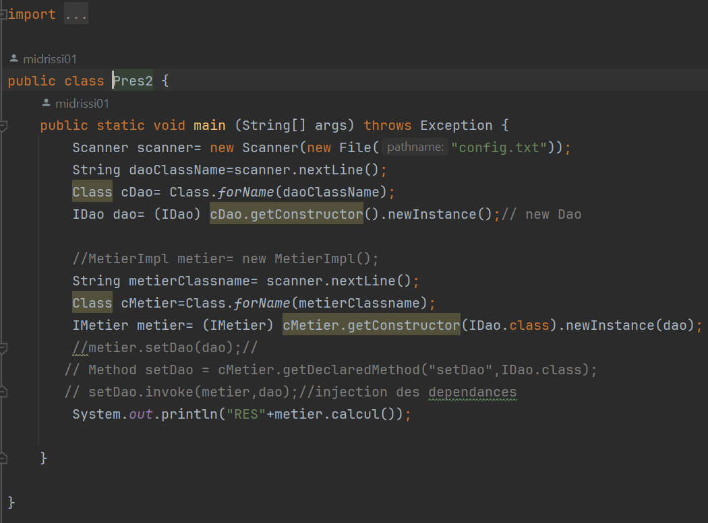

execution

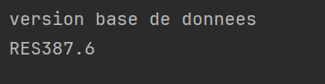
<h3>Injection des dépendances en utilisant Spring version xml</h3>

On doit installer en premier lieu les dépandences, ensuite editer le fichier pom.xml

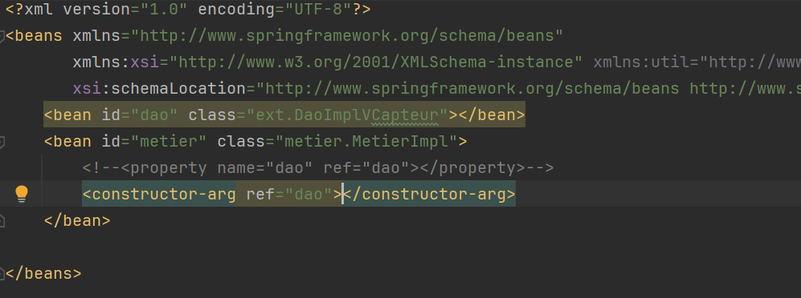
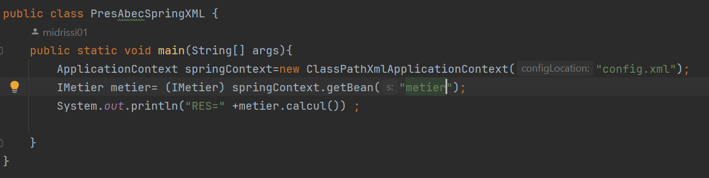

execution

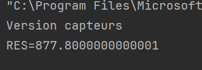
<h3>Injection des dépendances en utilisant Spring version annotations</h3>

Repository Class

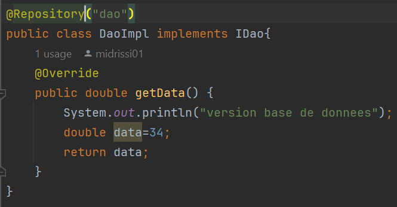

Service Class

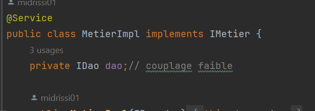

Controller

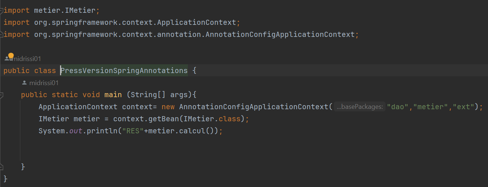